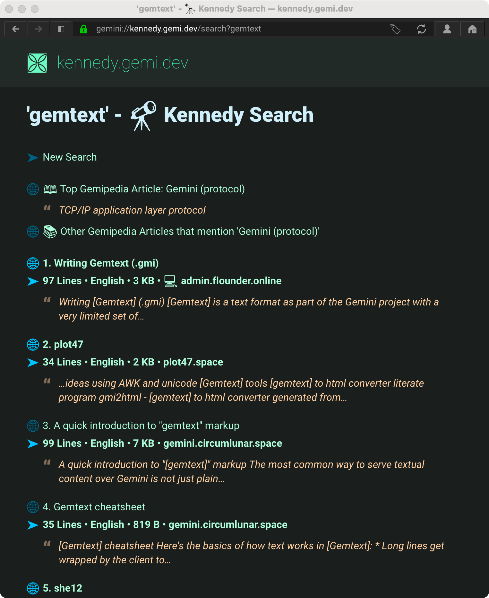

# Kennedy
Kennedy is a search engine for [Gemini space](https://en.wikipedia.org/wiki/Gemini_(protocol)). It consists of a crawler, backend, and Gemini app server. Kennedy leverages many of the techniques and architecture from early WWW crawlers and search engines like Mercator, Archive.org, and GoogleBot.

## Demo:
Visit `gemini://kennedy.gemi.dev` with a [Gemini client](https://github.com/kr1sp1n/awesome-gemini) or [via an HTTP-to-Gemini proxy](https://portal.mozz.us/gemini/kennedy.gemi.dev)

## Features
* Full Text search, with Porter Steming
* Content language classification using ngrams instead of MIME types `lang=` parameters
* PageRank-dervied algorithm to better determine results revelance 
* I'm Feeling Lucky! Automatically takes you to the first result for your search.
* 😻 Favicons: A capsule's Favicon is displayed for each search result to make skimming easier.
* Clean Snippets: Search results include a snippet of content which matches your query. Your keywords are [surrounded] with brackets, and gemtext formatting is removed to make it cleaner to read.
* Lines count: To help you sort quick articles from longer form content, search results tell you how many lines are in the content. If you want to be nerdy, I also include byte sizes.

## Why?
>Many years ago the great British explorer George Mallory, who was to die on Mount Everest, was asked why did he want to climb it. He said, "Because it is there."

[John F. Kennedy Address at Rice University, Sept. 12, 1962](https://www.rice.edu/kennedy)

## Projects
- **Kennedy.Crawler** - Crawler logic (Url Frontiers, Queues, etc)
- **Kennedy.CrawlData** - Models and storage systems for documents, meta data, and full text search
- **Kennedy.Server** - Gemini Server to handle queries and search results. Built on top of [RocketForce](https://github.com/acidus99/RocketForce), a .NET Gemini server and application framework
- **Kennedy.SearchConsole** - Console app for running FTS queries. Used for testing
